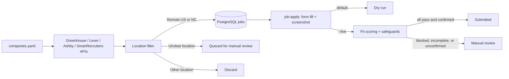

# Job Agent

A privacy-conscious job discovery and application assistant, built in reviewable phases.

**Current status: Phases 1–4 are implemented.** The agent fetches public listings from Greenhouse, Lever, Ashby, and SmartRecruiters boards, keeps US-remote and North Carolina roles, and records them in PostgreSQL. It scores fit with Anthropic, fills application forms in a visible browser with grounded answers, and saves a screenshot. Dry run is the default. Submission happens only with an explicit `--live` flag and only when every safeguard passes.

## Architecture



## Design Decisions

- **Two LLM steps:** LLM use is limited to fit scoring and grounded answers to custom application questions. Fetching, filtering, deduplication, safeguards, and persistence are deterministic code. Phase 2 implements scoring; Phase 3 adds conservative factual answers and candidate-reviewed motivation drafts.
- **LLM provider:** The fit scorer uses Anthropic's API with a required structured tool response validated by Pydantic. The API key is read from local `.env` configuration and must never be committed. Tests mock the SDK and do not make API calls.
- **No LinkedIn scraping:** LinkedIn pages and Easy Apply are not automated. The planned LinkedIn integration reads alert emails and locates the employer's own posting.
- **Platform tiers:** Greenhouse, Lever, Ashby, and SmartRecruiters are Tier 1; Workday is Tier 2; iCIMS, Taleo, SuccessFactors, and unrecognized forms are Tier 3/manual review. All four Tier 1 platforms have fetchers and form fillers.
- **Grounding:** Factual custom answers must be exact phrases present in the private profile or resume. Motivation drafts cite exact evidence from the profile, resume, or job description, remain blank in the form, and require candidate review. Unknown facts and qualification claims are not guessed.
- **Explicit answer policy:** The configured candidate response is `No` for prior application/interview questions and `Yes` for AI application-policy understanding. Qualification questions require evidence or manual review; they are never automatically affirmed.
- **Privacy and submission safety:** Personal profile data, resumes, screenshots, review pages, browser state, local databases, and `.env` are ignored by Git. `profile/profile.example.yaml` contains fictional data. Forms are filled in dry-run mode by default; live submission requires `--live` and the safeguards described below.
- **Duplicate prevention:** Job URLs have a database uniqueness constraint and are checked before insert. The CLI commits each accepted listing so one later failure does not discard earlier discoveries.
- **Location scope:** Only `remote_us` and `nc` are retained. Remote roles must explicitly indicate US-wide eligibility; a bare `Remote` or a restricted state/region is not treated as US-wide. A bare country label such as `United States` is queued under Check location, because it could be on-site anywhere; Lever, Ashby, and SmartRecruiters jobs flagged remote by the board are labelled `Remote - ...` so they count as remote. Hybrid NC inclusion is controlled by settings.
- **Role scope:** Only AI and agent engineering roles are kept: a title must contain one of `discovery.title_keywords` (AI, agent, agentic, LLM, machine learning, ML, GenAI, NLP, ...) and one of `discovery.title_role_keywords` (engineer, developer, scientist, researcher, ...), so "AI Engineer", "Agent Engineer", and "Forward Deployed Engineer, Agentic Platform" are kept while "Account Executive, AI" and "Backend Engineer" are not. Internships, co-ops, and new-grad roles are never kept (`discovery.exclude_title_keywords` for titles, `discovery.exclude_description_phrases` for descriptions). Discovery drops these, and `job-run` removes any already found, leaving applied and prepared jobs alone.
- **Unclear locations:** Labels such as `Multiple locations` and `Flexible` are persisted with `queued` status for manual review. They are not treated as eligible for automatic application.

## Setup

Requires Python 3.11+, Docker Compose, and Git. GitHub Actions runs Ruff and pytest on pushes and pull requests.

1. Create a virtual environment and install the project:

   ```powershell
   py -3.11 -m venv .venv
   .\.venv\Scripts\Activate.ps1
   python -m pip install -e ".[dev]"
   ```

2. Copy `.env.example` to `.env`. Change the local database password if the database will be reachable beyond your machine.

3. Start PostgreSQL and apply the schema migration:

   ```powershell
   docker compose up -d db
   alembic upgrade head
   ```

   Install the Playwright Chromium browser for local form dry runs:

   ```powershell
   python -m playwright install chromium
   ```

4. Add companies to `config/companies.yaml`. Each entry needs a display name, a platform, and the board token or company id from the public board URL:

   ```yaml
   companies:
     - name: Example Company
       platform: greenhouse
       board: example-company
     - name: Another Company
       platform: lever
       board: another-company
   ```

   Supported platforms are `greenhouse`, `lever`, `ashby`, and `smartrecruiters`. Career pages remain for a later phase.

5. Run discovery:

   ```powershell
   job-agent
   ```

   Discovery also reads two remote job sources (`discovery.remote_boards`): the public [We Work Remotely](https://weworkremotely.com) RSS feed, keeping jobs whose region includes the US, and the latest Hacker News "Who is hiring?" thread through HN's public Algolia API, reading each post's `Company | Role | Location` line. Their jobs link to the posting and are applied to by hand. Sites that block automated access, such as SimplyHired, and sources whose robots.txt disallows their API, such as Remotive, are not used.

   Discovery searches your configured companies plus every company with a Greenhouse, Lever, Ashby, or SmartRecruiters board on the public, community-maintained [SimplifyJobs New-Grad-Positions](https://github.com/SimplifyJobs/New-Grad-Positions) list (`--no-new-grad-list` or `discovery.include_new_grad_list: false` turns that off). Each company's whole board is fetched through its public API, so roles not on the list are found too. Each job is labelled early career, mid, senior, or not stated from its title and the years of experience it requires; by default only early-career and not-stated roles are kept (`discovery.experience_levels` in `config/settings.yaml`).

   The CLI prints newly found and previously known in-scope listings. It continues to other companies if one board request fails. `DATABASE_URL` from `.env` overrides `config/settings.yaml`.

Install the privacy guard once per clone. It is a git pre-commit hook that blocks any commit staging private files (profile, resumes, `.env`, databases, screenshots, review pages, the dashboard, browser profiles) or added lines containing identifying values from your local profile (name, email, phone, profile links, location, employers, schools, start date, resume file name). It reads those values locally and reports only categories:

```powershell
python scripts/install_hooks.py
```

To run the tests and linter without PostgreSQL:

```powershell
pytest
ruff check .
```

The tests use SQLite (in memory or in temporary files), mocked HTTP responses, and a fake browser page; they do not contact job boards or the Anthropic API.

## Finding, Scoring, and Preparing Jobs in One Step

```powershell
job-run
```

runs discovery, fit-scores every job that has no score yet (`--score-limit`, default 150; one Anthropic call each), and prepares answers for the best new matches (`--prepare N`, default 5) by running the ordinary headless dry run on each. Jobs whose fit check finds unmet requirements or a low score move to Skipped. Each company keeps at most `discovery.max_jobs_per_company` open jobs (default 2): prepared jobs first, then the highest fit scores; the rest are removed. Applied jobs are never removed or counted. Prepared jobs move to **Ready for you**, and the dashboard opens. `--skip-discovery` reuses jobs already found. Nothing is submitted: finish each prepared application with its hand-off or assist command.

Open-ended questions (for example "summarize your top two technical accomplishments", "describe a project you're proud of", or any "why" question) get a written draft built only from your profile, resume, and the job description, with every sentence tied to an exact source quote. Drafts are left blank in the form and shown on the dashboard and review page with a Copy button, so you can check them before pasting.

## Applying to a Job

`job-apply` works with Greenhouse, Lever, Ashby, and SmartRecruiters; pass the matching `--platform`. Pass the job's HTTPS URL on that platform's host: either the posting URL that discovery stores or the application form URL. On Lever, Ashby, and SmartRecruiters the posting page has no form, so the filler reads the job description there and then opens the form (`/apply`, `/application`, or SmartRecruiters' one-click link). This runs a headless browser (pass `--headed` to watch it), fills supported fields from the private profile, uploads the PDF resume, and saves a full-page screenshot under the ignored `screenshots/` directory. Factual answers use exact source quotes. “Why?” questions, accomplishment and project questions, and any long or multi-part question in a large text box get evidence-cited written drafts. In a dry run they are left blank and shown on the review page and dashboard; `--hand-off` types them into the form for you to review before you submit, and `--fill-reviewed-motivation-drafts` does the same in other modes. Qualification questions remain blank unless `personal.meets_job_requirements: true` is explicitly set in the private profile.

```powershell
job-apply --platform greenhouse --job-url "https://boards.greenhouse.io/example/jobs/123" --company "Example Company" --title "Software Engineer"
```

In a dry run, company, title, and job description come from the database when the URL was discovered and the database is reachable; otherwise the description is read from the posting page. `--company` and `--title` override the stored values. Pass `--profile`, `--resume`, or `--screenshot` to override the local defaults. Missing evidence, unsupported controls, and answer-service errors leave the affected field blank and mark the result for manual review. Checkbox and radio groups are listed once per question for manual review. If the application page shows a bot-protection CAPTCHA instead of a form, nothing is filled: the page is screenshotted and marked for manual completion. The agent does not try to bypass CAPTCHAs.

The resume defaults to `RESUME_PATH` from the environment or the ignored local `.env`, so a personal filename never has to appear in the repository:

```dotenv
RESUME_PATH=profile/my_resume.pdf
```

Relative paths are resolved from the project root. Without `RESUME_PATH`, the default is `profile/resume.pdf`; `--resume` overrides both. Resume PDFs under `profile/` are ignored by Git.

After every dry run, an HTML review page is saved under the ignored `reviews/` directory (override with `--review`). Open it in a browser to check:

- the job title, company, URL, outcome, and screenshot link;
- the fit score, reasons, and dealbreakers: a stored score from the database when one exists, otherwise a fresh Anthropic score of the job description, or a note explaining why the job was not scored;
- every field as **filled**, **draft, not filled**, **manual review**, or **skipped**, with the full filled value and a note saying why a field was left blank or skipped. Written answers and motivation drafts are shown in full.

The CLI also prints the review path and a count of fields per status.

### Saved answers for choice questions

Radio buttons, checkboxes, and dropdowns are answered from saved facts only: `work_authorization` (authorized to work, sponsorship) and an `application_answers` section in the private profile (current employer, referral source, start date, location, relocation, which places allow on-site work and for how many days, clearance, polygraph, AI-notetaker consent, languages, and voluntary demographic answers). Saved text answers such as the start date or "How did you hear about this job?" are typed in directly without calling the answer model. See `profile/profile.example.yaml` for the shape. Each saved answer is matched to the form's own wording (for example "No" to "I am not a protected veteran"); a language with no option of its own selects "Other". Questions with no saved answer, or whose options don't match it, stay blank with a note in the review page. Legal acknowledgements such as arbitration agreements are never ticked automatically. Fields labelled "Date" are filled with today's date (America/New_York).

### Finishing an application yourself (hand-off)

`--hand-off` fills the real form in a visible browser and leaves it open for you:

```powershell
python -m agent.applier.cli --hand-off --platform lever --job-url "https://jobs.lever.co/example/123"
```

- Log in if the site asks, check every field against the review page (it opens automatically), answer the questions marked for manual review, and submit the form yourself. The agent never clicks Submit in this mode.
- The browser is your installed Google Chrome (`--browser chromium` uses Playwright's bundled browser instead; Chrome falls back to it automatically if it is not installed). It uses a separate saved profile under the ignored `.playwright/profile/` directory, so sites you sign into there stay signed in on later runs. `--browser-profile` picks another folder; your everyday Chrome profile is refused, because Chrome blocks automation there and it holds all your logins.
- Submit soon after the form fills, because CAPTCHA checks expire. Reloading the page clears the answers, so if a CAPTCHA has expired, close the window and run the command again for a fresh fill.
- If a CAPTCHA appears, solve it yourself in that window; filling continues once the form shows (the agent waits up to 10 minutes and never tries to solve it).
- Close the window when you are done. Every review page includes a **Finish this application** section with the form link and this command, already filled in for that job.

`--hand-off` cannot be combined with `--live`.

### Copying answers into your own browser (assist)

Some sites reject applications from browsers that software is driving. `--assist` works out every answer in a hidden browser, then opens the application form in your normal browser, untouched by automation, together with the review page. Every filled value, draft, and the resume file path has a **Copy** button; paste each answer into the form, upload the resume, and submit it yourself:

```powershell
python -m agent.applier.cli --assist --platform lever --job-url "https://jobs.lever.co/example/123"
```

Every browser the agent opens keeps Chrome's security sandbox on.

If a Lever form says "error verifying your application" even when filled entirely by hand, its background CAPTCHA is failing for your browser or network: try a Guest window without extensions, turn off any VPN, allow third-party cookies for `jobs.lever.co`, or try another network.

Live submission is an explicit `--live` opt-in. Before opening the form, the CLI:

- requires the job to be in the database (run discovery first);
- re-scores it and blocks scores below threshold or any dealbreakers;
- blocks jobs whose status is `queued` or `manual_review`;
- blocks a job that already has a live attempt, and enforces the daily cap and per-company monthly cap.

Caps reset at midnight America/New_York time. Live attempts are recorded with answers, screenshot path, and submission timestamp. If any form field needs manual review, submission is blocked.

After clicking submit, the applier waits for a confirmation message. On every platform, a click error or a missing confirmation is recorded as `unknown`: the error is logged and stored on the application, and the job moves to `manual_review`. Check the employer site or your email before retrying.

Apply the latest migration before using live mode, because live-attempt caps track each attempt's start time:

```powershell
alembic upgrade head
```

Any existing live-attempt record for a job blocks another attempt, even if the browser outcome was ambiguous. Reconcile the application manually before changing/deleting that record; this is intentionally fail-closed.

```powershell
job-apply --platform greenhouse --job-url "https://boards.greenhouse.io/example/jobs/123" --live
```

## Dashboard

```powershell
python -m agent.dashboard
```

writes and opens `dashboard.html` (git-ignored): every discovered job with its company, role, level, location, match score, last activity, and status, filterable and searchable. Summary tiles count jobs found, fit scored, strong matches, answers ready, and applied. **Details** on any row shows why it matches, any unmet requirements, and every prepared answer, draft, and blank field with the reason it was left blank, each answer with a Copy button.

- **Ready for you:** the form was filled; open it with the command under **Finish**, answer what is left, and submit it yourself.
- **New:** found by discovery and not attempted yet, highest fit first. Unmet requirements are flagged in red.
- **Check location:** the location label was too vague to decide.
- **Applied:** with the date. When a hand-off window closes, the terminal asks whether you submitted and records the answer.
- **Skipped:** low fit, unmet requirements, or marked by hand.

Discovery and every `job-apply` run refresh the page.

`job-dashboard` (and the end of `job-run`) opens the dashboard at `http://127.0.0.1:8765/`, served from your own computer and reachable only there. Leave that terminal open while you use it; Ctrl+C stops it. Every row has:

- **Mark applied**: click it once you submit. The job moves to Applied with today's date, and the button becomes **Applied ✓ · Undo**, which puts the job back where it was.
- **Remove**: hides a job you decide is not a fit, with Undo. Removed jobs stay in the database so discovery never adds them back.

`dashboard.html` is still written as a view-only copy (`job-dashboard --file` opens it). Opened that way, the page shows a banner and the buttons show the equivalent command instead: `python -m agent.dashboard --mark-applied "JOB URL"`, `--mark-new`, `--mark-skipped`, or `--mark-removed`.

Before filling a form, `job-apply` checks the stored job against your profile. Jobs with unmet requirements (for example a spoken language you do not list) or a low fit score are not filled and are marked Skipped with the reason; `--ignore-fit` fills them anyway.

## Configuration

`config/settings.yaml` controls location behavior, HTTP retry backoff, the fit-score threshold, the Anthropic model, and the live-application caps (`safeguards.daily_application_cap` and `safeguards.company_monthly_application_cap`, both counted in America/New_York time). Set `location.include_hybrid_nc` to `false` to exclude hybrid roles even when located in North Carolina. Put `ANTHROPIC_API_KEY` in the ignored local `.env`; never put a real key in `.env.example` or source control. The private `profile/profile.yaml` and resume PDF are intentionally absent; copy the fictional example only as a schema reference and keep real personal material local.

## Results

_To be filled in as the project is exercised: companies configured, jobs discovered, location-filter results, and lessons learned._

## Roadmap

1. Project setup, Greenhouse discovery, database, and location filtering. (Done.)
2. Anthropic-backed structured fit scoring with validated output and mocked tests. (Done.)
3. Greenhouse form filling in dry-run mode, grounded answers, and screenshots. (Done.)
4. Lever, Ashby, and SmartRecruiters fetchers/appliers, explicit live mode, and application safeguards. (Done.)
5. Career-page routing and LinkedIn alert email parsing.
6. Grounded resume tailoring with claim traceability checks.
7. Workday fetcher and applier.
8. Daily scheduling. (`job-run` covers discovery, scoring, and preparation in one command; the static dashboard shows matches and answers.)
