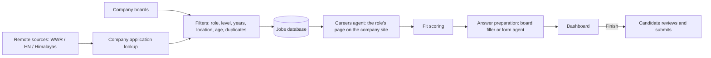

# Job Agent


Job Agent is a privacy-conscious job search assistant. It finds AI and agent engineering roles that are US-remote or in North Carolina, and scores each one against a private candidate profile. It prepares a grounded answer for every application question and fills in the forms. The candidate reviews every application and submits it.

## Highlights

- **Discovery across many sources.** It reads Greenhouse, Lever, Ashby, and SmartRecruiters boards through their public APIs, plus We Work Remotely, Hacker News "Who is hiring?", and Himalayas. Companies are also found automatically from the SimplifyJobs list. Rule-based filters keep only roles that match on title, seniority, years required (roles open to recent graduates or needing at most 2 years), location, and posting age, and duplicates are removed. Jobs already found are checked again on every run, after the company's own page fills in the full description.
- **Three Claude agents, each checked in code:**
  - The **careers agent** finds a third-party job on the company's own site and links to that role's page or application form. It never links to the general careers page. The title must appear on a page the agent actually opened.
  - The **form agent** fills unfamiliar forms such as Workday, iCIMS, Zoho Recruit, and custom career sites. It reads controls inside iframes and works through multi-page forms. It records every question it sees, and anything it can't answer is listed for the candidate. Code refuses any click that would submit the application.
  - The **library agent** drafts written answers from a private folder of essays and project write-ups. Every sentence must carry a quote from a named document, and code verifies each quote.
- **Grounded answers.** Structured outputs validated with Pydantic are used for fit scoring and for answers. Factual answers must be exact phrases from the profile or resume. Written drafts cite evidence for every sentence and are never submitted without the candidate's review.
- **The candidate submits.** Every run is a dry run unless stated otherwise. A dry run saves a screenshot and an HTML review page. Hand-off mode fills the form in Chrome and leaves the window open for the candidate. Assist mode lets the candidate copy answers into their own browser. Live mode is opt-in and guarded by fit re-checks, daily and per-company caps, and fail-closed handling of unconfirmed submissions.
- **An apply kit for each job, from two sub-agents.** The **resume sub-agent** rebuilds the resume from a long private experience bank around the job description's exact keywords (its action verbs and tech stack), showing how each tool was used in each project. Every bullet must quote its sources, and code rejects any tool or number the sources don't support; keywords with no evidence are asked about, not invented. Its content comes from a master CV of every activity, and its look (font, text size, section headings in order) is copied from the candidate's own one-page resume, the format example; without one it is Times New Roman with Education, Experience, Technical Projects, and Skills. The output is a one-page Word document, 10 pt or larger; terms from the required and preferred qualifications are covered first, and the lowest-value bullets are trimmed until it fits one page. The **answers sub-agent** answers every question on the form, plus why this company, why this role, and a technical project, specific to the company and role and written in the candidate's voice from their writing samples.
- **Local dashboard.** It shows every job with its fit score, posting age, and prepared answers. Clicking **Apply** opens the role on the company's site in a new tab and opens a sidebar with every answer (with Copy buttons) and the tailored resume to download. Buttons let the candidate prepare the kit, mark a job applied, undo, remove it, or start the form agent on the job's real form.
- **Privacy by design.** Personal data never enters Git. A custom pre-commit hook blocks private files and any line containing identifying values from the local profile.

## Tech Stack

| Area | Technology |
| --- | --- |
| Language | Python 3.11+ (developed on 3.12), JavaScript for the in-page form snapshot |
| LLM | Anthropic Claude API: Sonnet 5.5 for scoring, answers, and the careers agent; Opus 5.5 for the form agent. Uses tool use, structured outputs, web search, and refusal fallback |
| Browser automation | Playwright (Chromium and installed Chrome) |
| Data | SQLAlchemy 2 with SQLite (default) or PostgreSQL 16; Alembic migrations; Pydantic v2 |
| HTTP and documents | httpx, pypdf, python-docx (tailored resumes), PyYAML, python-dotenv |
| Web UI | Standard-library `http.server`, HTML, CSS, JavaScript |
| Quality | pytest (offline: mocked HTTP and SDK, real headless browser), Ruff, GitHub Actions CI |
| Infrastructure | Docker Compose (optional Postgres), Git pre-commit hook |

Dependency ranges are in [pyproject.toml](pyproject.toml). The tested versions are anthropic 0.125, playwright 1.63, SQLAlchemy 2.1, alembic 1.20, pydantic 2.13, httpx 0.28, pytest 8.4, and ruff 0.16.

## Architecture



```text
agent/
  main.py, pipeline.py      discovery and the job-run pipeline
  filters.py, seniority.py  deterministic scope and duplicate rules
  scorer.py, answers.py     Claude fit scoring and grounded answers
  careers_agent.py          finds the role on the company's own site
  form_agent.py (+ .js)     agent for unfamiliar forms
  library_agent.py          cited drafts from the private source library
  apply_kit.py              job-kit: runs the resume and answers sub-agents for one job
  resume_tailor.py          resume sub-agent: exact-keyword resume, every bullet sourced
  resume_format.py          master CV and format example: what the resume picks from, how it looks
  answer_agent.py           answers sub-agent: every question for one job
  dashboard.py              local dashboard server
  fetchers/, sources/       job board APIs and remote sources
  applier/                  board form fillers, review pages, hand-off/assist/live CLI
db/                         SQLAlchemy models and Alembic migrations
scripts/                    privacy pre-commit hook
tests/                      offline test suite
```

## Quick Start

```powershell
py -3.12 -m venv .venv312; .\.venv312\Scripts\Activate.ps1
python -m pip install -e ".[dev]"
python -m playwright install chromium
copy .env.example .env               # add ANTHROPIC_API_KEY and RESUME_PATH
python scripts/install_hooks.py      # privacy guard
job-run                              # discover, score, prepare, open the dashboard
job-daily --install                  # prepare new jobs every morning before 9am Eastern
```

`job-daily --install` registers a morning run with Windows Task Scheduler (or cron on macOS and Linux). It finds and scores new jobs, then builds a tailored resume and every answer for each good match, so they are waiting in the dashboard by `daily_run.ready_by` in [config/settings.yaml](config/settings.yaml). The log is in `data/daily-run.log`.

Put your private profile in `profile/profile.yaml` (see the fictional [profile.example.yaml](profile/profile.example.yaml)). Put your master CV (every job, project, and activity) at `profile/master_cv.pdf`, or set `MASTER_CV_PATH` in `.env`; the resume at `RESUME_PATH` is the format example, or set `RESUME_FORMAT_PATH`. Put your long list of jobs, projects, and activities (any Markdown, text, PDF, or Word files) in `profile/library/`, and samples of your own writing in `profile/writing_samples/`. All three are git-ignored and blocked by the privacy hook. The scope, models, and caps are set in [config/settings.yaml](config/settings.yaml).

| Command | What it does |
| --- | --- |
| `job-run` | Full pipeline: discovery, fit scoring, company page lookup, answer preparation, dashboard |
| `job-agent` | Discovery only |
| `job-apply` | Fill a Greenhouse, Lever, Ashby, or SmartRecruiters form (dry run; `--hand-off`, `--assist`, `--live`) |
| `job-agent-fill` | Run the form agent on any other application form |
| `job-company-pages` | Find third-party jobs on the company's own site |
| `job-daily` | Morning run: find, score, and build kits for new good matches; `--install` schedules it every morning (Task Scheduler or cron), `--uninstall` stops it |
| `job-kit` | Build one job's kit: tailored resume and every answer (`--list` for job ids, `--question` for one-off answers) |
| `job-dashboard` | Serve the dashboard at `http://127.0.0.1:8765/` |

Run `pytest` and `ruff check .` to test and lint. The tests make no network or API calls.

For Claude Code, [.claude/skills/](.claude/skills/) has three skills (`apply-kit`, `tailor-resume`, `answer-questions`) that run these commands directly instead of re-deriving the workflow.

## Safety Rules

- **Nothing is submitted without the candidate,** except with `--live`, and only when every safeguard passes.
- **No accounts, passwords, or CAPTCHAs.** The agents hand these to the person at the browser.
- **No guessed facts or qualifications.** Unanswerable fields are left blank and listed for review.
- **No LinkedIn scraping, and robots.txt is respected.** Sites that block automated access are not used.

## Lessons Learned

- **Check the model's claims in code.** The careers agent once reported a role from a search result it never opened, and once reported a list of openings as the role. Code now requires the title on a page the agent opened, and follows a list to the role's own page.
- **Give the model every field the source has.** The fit scorer rejected strong remote matches because it never saw the board's "USA - Remote" label.
- **Record what the agent sees, not only what it does.** Questions on later pages, inside iframes, or past a control limit went undocumented. Every observed question is now recorded, and while a Next button remains, the agent's first attempt to finish is sent back.
- **Custom forms rarely link questions to fields.** Reading the nearest label-like text gave unlabeled Zoho fields their questions.
- **Worker threads must not share a database session.** Fit scoring failed one job in three until job fields were read before the threads started.

## Roadmap

Phases 1–12 are done (Oct 1–6, 2026). They cover discovery, fit scoring, board fillers, live safeguards, hand-off and assist modes, the dashboard, targeted discovery, the form agent, the source library, the careers agent, fresh postings first, and the apply kit (tailored resume and answers). Two phases are planned:

- LinkedIn alert email parsing
- Daily scheduling
