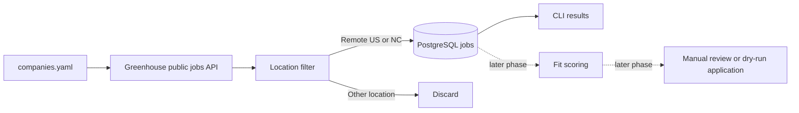

# Job Agent

A privacy-conscious job discovery and application assistant, built in reviewable phases. Phase 1 fetches public Greenhouse listings, filters for US-remote and North Carolina roles, and records new jobs in PostgreSQL. It does not score jobs or submit applications.

## Architecture



## Design Decisions

- **Two LLM steps:** LLM use is limited to fit scoring and grounded answers to custom application questions. Fetching, filtering, deduplication, safeguards, and persistence are deterministic code. Phase 2 implements scoring; Phase 3 adds conservative factual answers and candidate-reviewed motivation drafts.
- **LLM provider:** The fit scorer uses Anthropic's API with a required structured tool response validated by Pydantic. The API key is read from local `.env` configuration and must never be committed. Tests mock the SDK and do not make API calls.
- **No LinkedIn scraping:** LinkedIn pages and Easy Apply are not automated. The planned LinkedIn integration reads alert emails and locates the employer's own posting.
- **Platform tiers:** Greenhouse, Lever, Ashby, and SmartRecruiters are Tier 1; Workday is Tier 2; iCIMS, Taleo, SuccessFactors, and unrecognized forms are Tier 3/manual review. Phase 1 implements Greenhouse discovery only.
- **Grounding:** Factual custom answers must be exact phrases present in the private profile or resume. Motivation drafts cite exact evidence from the profile, resume, or job description, remain blank in the form, and require candidate review. Unknown facts and qualification claims are not guessed.
- **Explicit answer policy:** The configured candidate response is `No` for prior application/interview questions and `Yes` for AI application-policy understanding. Qualification questions require evidence or manual review; they are never automatically affirmed.
- **Privacy and submission safety:** Personal profile data, resumes, screenshots, browser state, local databases, and `.env` are ignored by Git. `profile/profile.example.yaml` contains fictional data. Phase 3 has no submit action; the Greenhouse CLI fills and screenshots only.
- **Duplicate prevention:** Job URLs have a database uniqueness constraint and are checked before insert. The CLI commits each accepted listing so one later failure does not discard earlier discoveries.
- **Location scope:** Only `remote_us` and `nc` are retained. Remote roles must explicitly indicate US-wide eligibility; a bare `Remote` or a restricted state/region is not treated as US-wide. Hybrid NC inclusion is controlled by settings.
- **Unclear locations:** Labels such as `Multiple locations` and `Flexible` are persisted with `queued` status for manual review. They are not treated as eligible for automatic application.

## Setup

Requires Python 3.11+, Docker Compose, and Git. GitHub Actions runs Ruff and pytest on pushes and pull requests.

1. Create a virtual environment and install the project:

   ```powershell
   py -3.11 -m venv .venv
   .\.venv\Scripts\Activate.ps1
   python -m pip install -e ".[dev]"
   ```

2. Copy `.env.example` to `.env`. Change the local database password if the database will be reachable beyond your machine.

3. Start PostgreSQL and apply the schema migration:

   ```powershell
   docker compose up -d db
   alembic upgrade head
   ```

   Install the Playwright Chromium browser for local form dry runs:

   ```powershell
   python -m playwright install chromium
   ```

4. Add companies to `config/companies.yaml`. Each entry needs a display name and Greenhouse board token:

    ```yaml
    companies:
       - name: Example Company
          platform: greenhouse
          board: example-company
    ```

   Phase 4 supports Greenhouse, Lever, Ashby, and SmartRecruiters public boards. Career pages remain for a later phase.

5. Run discovery:

   ```powershell
   job-agent
   ```

   The CLI prints newly found and previously known in-scope listings. It continues to other companies if one board request fails. `DATABASE_URL` from `.env` overrides `config/settings.yaml`.

To run the tests and linter without PostgreSQL:

```powershell
pytest
ruff check .
```

The tests use SQLite in memory and mocked HTTP responses; they do not contact job boards.

## Greenhouse Dry Run

Use a direct HTTPS Tier 1 application URL. This opens a visible browser, fills supported fields from the private profile, uploads the PDF resume, and saves a full-page screenshot under the ignored `screenshots/` directory. Factual answers use exact source quotes. “Why?” and personal-fit responses are evidence-cited drafts; `--fill-reviewed-motivation-drafts` is an explicit opt-in to fill them. Qualification questions remain blank unless `personal.meets_job_requirements: true` is explicitly set in the private profile.

```powershell
job-apply --platform greenhouse --job-url "https://boards.greenhouse.io/example/jobs/123" --company "Example Company" --title "Software Engineer"
```

Pass `--profile`, `--resume`, or `--screenshot` to override the local defaults. Missing evidence, unsupported controls, and answer-service errors leave the affected field blank and mark the result for manual review. The default local resume path is `profile/resume.pdf`; it is ignored by Git.

Live submission is an explicit `--live` opt-in. Before opening the form, the CLI requires a discovered database job, calls the fit scorer, blocks scores below threshold or any dealbreakers, and checks duplicate submission, daily cap, and company monthly cap safeguards. Live attempts are recorded with answers, screenshot path, and submission timestamp. If any form field needs manual review, submission is blocked.

Apply the latest migration before using Phase 4, because live-attempt caps track each attempt's start time:

```powershell
alembic upgrade head
```

Any existing live-attempt record for a job blocks another attempt, even if the browser outcome was ambiguous. Reconcile the application manually before changing/deleting that record; this is intentionally fail-closed.

```powershell
job-apply --platform greenhouse --job-url "https://boards.greenhouse.io/example/jobs/123" --live
```

## Configuration

`config/settings.yaml` controls location behavior, HTTP retry backoff, the fit-score threshold, and the Anthropic model. Set `location.include_hybrid_nc` to `false` to exclude hybrid roles even when located in North Carolina. Put `ANTHROPIC_API_KEY` in the ignored local `.env`; never put a real key in `.env.example` or source control. The private `profile/profile.yaml` and `profile/resume.pdf` are intentionally absent; copy the fictional example only as a schema reference and keep real personal material local.

## Results

_To be filled in as the project is exercised: companies configured, jobs discovered, location-filter results, and lessons learned._

## Roadmap

1. Project setup, Greenhouse discovery, database, and location filtering.
2. Anthropic-backed structured fit scoring with validated output and mocked tests. (Implemented and pushed.)
3. Greenhouse form filling in dry-run mode, grounded answers, and screenshots. (Implemented locally; pending review.)
4. Lever, Ashby, and SmartRecruiters fetchers/appliers, explicit live mode, and application safeguards. (Implemented locally; pending review.)
5. Career-page routing and LinkedIn alert email parsing.
6. Grounded resume tailoring with claim traceability checks.
7. Workday fetcher and applier.
8. Daily scheduling and a FastAPI dashboard with run metrics.
