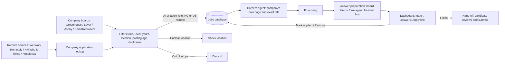

# Job Agent

A privacy-conscious job discovery and application assistant, built in reviewable phases.

**Current status: Phases 1–11 are implemented.** The agent finds AI and agent engineering roles that are remote in the US or in North Carolina, from company boards (Greenhouse, Lever, Ashby, SmartRecruiters) and remote job sources (We Work Remotely, Hacker News "Who is hiring?", Himalayas), newest postings first so you can apply early. It scores each job's fit against a private profile with Anthropic, finds jobs from third-party sites on the company's own careers site with a careers agent (showing the company's exact title and linking to its application form), prepares grounded answers to every application question, and shows everything on a local dashboard where jobs are marked applied or removed. Unfamiliar forms (Workday, company career pages, custom widgets) are filled by a model-driven form agent, and written answers can draw on a private library of essays and project write-ups through an agent that decides what to look up. Submitting stays with the candidate: forms are filled in dry runs, in a browser left open for the candidate (hand-off), or copied from the review page (assist). Automatic submission happens only with an explicit `--live` flag and only when every safeguard passes.

## Architecture



## Design Decisions

- **Where models are used:** fit scoring, grounded answers to custom application questions (including the library lookup agent), and the form agent for unfamiliar forms. Fetching, filtering, deduplication, safeguards, and persistence are deterministic code. Phase 2 implements scoring; Phase 3 adds conservative factual answers and candidate-reviewed motivation drafts.
- **LLM provider:** The fit scorer uses Anthropic's API with a required structured tool response validated by Pydantic. The API key is read from local `.env` configuration and must never be committed. Tests mock the SDK and do not make API calls.
- **No LinkedIn scraping:** LinkedIn pages and Easy Apply are not automated. The planned LinkedIn integration reads alert emails and locates the employer's own posting.
- **Platform tiers:** Greenhouse, Lever, Ashby, and SmartRecruiters are Tier 1; Workday is Tier 2; iCIMS, Taleo, SuccessFactors, and unrecognized forms are Tier 3/manual review. All four Tier 1 platforms have fetchers and form fillers.
- **Grounding:** Factual custom answers must be exact phrases present in the private profile or resume. Written drafts (motivation, accomplishment, and other open-ended answers) cite exact evidence from the profile, resume, or job description, are left blank in dry runs, and are typed into the form only in hand-off mode, where the candidate reviews them before submitting. Unknown facts and qualification claims are not guessed.
- **Explicit answer policy:** The configured candidate response is `No` for prior application/interview questions and `Yes` for AI application-policy understanding. Qualification questions require evidence or manual review; they are never automatically affirmed.
- **Privacy and submission safety:** Personal profile data, resumes, screenshots, review pages, browser state, local databases, and `.env` are ignored by Git. `profile/profile.example.yaml` contains fictional data. Forms are filled in dry-run mode by default; live submission requires `--live` and the safeguards described below.
- **Duplicate prevention:** Job URLs have a database uniqueness constraint, and a listing with the same title at the same company as a stored job (ignoring case, punctuation, and suffixes such as Inc.) is treated as known, so a role seen on several boards is stored once. Marking a job applied twice records one submission. The CLI commits each accepted listing so one later failure does not discard earlier discoveries.
- **Location scope:** Only `remote_us` and `nc` are retained. Remote roles must explicitly indicate US-wide eligibility; a bare `Remote` or a restricted state/region is not treated as US-wide. A bare country label such as `United States` is queued under Check location, because it could be on-site anywhere; Lever, Ashby, and SmartRecruiters jobs flagged remote by the board are labelled `Remote - ...` so they count as remote. Hybrid NC inclusion is controlled by settings.
- **Role scope:** Only AI and agent engineering roles are kept: a title must contain one of `discovery.title_keywords` (AI, agent, agentic, LLM, machine learning, ML, GenAI, NLP, ...) and one of `discovery.title_role_keywords` (engineer, developer, scientist, researcher, ...), so "AI Engineer", "Agent Engineer", and "Forward Deployed Engineer, Agentic Platform" are kept while "Account Executive, AI" and "Backend Engineer" are not. Internships, co-ops, and new-grad roles are never kept (`discovery.exclude_title_keywords` for titles, `discovery.exclude_description_phrases` for descriptions). Discovery drops these, and `job-run` removes any already found, leaving applied and prepared jobs alone.
- **Unclear locations:** Labels such as `Multiple locations` and `Flexible` are persisted with `queued` status for manual review. They are not treated as eligible for automatic application.

## Setup

Requires Python 3.11+ and Git (Docker Compose only for the optional PostgreSQL database). GitHub Actions runs Ruff and pytest on pushes and pull requests.

1. Create a virtual environment and install the project:

   ```powershell
   py -3.12 -m venv .venv312
   .\.venv312\Scripts\Activate.ps1
   python -m pip install -e ".[dev]"
   ```

2. Copy `.env.example` to `.env`. Change the local database password if the database will be reachable beyond your machine.

3. The database defaults to a local SQLite file (`data/job_agent.db`, git-ignored) that is created and kept up to date automatically. To use PostgreSQL instead, set `DATABASE_URL` in `.env`, then start it and apply the migrations:

   ```powershell
   docker compose up -d db
   alembic upgrade head
   ```

   Install the Playwright Chromium browser for local form dry runs:

   ```powershell
   python -m playwright install chromium
   ```

4. Add companies to `config/companies.yaml`. Each entry needs a display name, a platform, and the board token or company id from the public board URL:

   ```yaml
   companies:
     - name: Example Company
       platform: greenhouse
       board: example-company
     - name: Another Company
       platform: lever
       board: another-company
   ```

   Supported platforms are `greenhouse`, `lever`, `ashby`, and `smartrecruiters`. Career pages remain for a later phase.

5. Run discovery:

   ```powershell
   job-agent
   ```

   Discovery also reads three remote job sources (`discovery.remote_boards`): the public [We Work Remotely](https://weworkremotely.com) RSS feed, keeping jobs whose region includes the US; the latest Hacker News "Who is hiring?" thread through HN's public Algolia API, reading each post's `Company | Role | Location` line; and the [Himalayas](https://himalayas.app) job search API, searched for AI, ML, LLM, and agent engineer roles open to the US at your `experience_levels` (first page of each search only, since its robots.txt disallows paged URLs). Each of their jobs is matched to the company's own application (see **Finding, Scoring, and Preparing Jobs in One Step**); jobs that cannot be matched link to the posting. Sites that block automated access, such as SimplyHired, and sources whose robots.txt disallows their API, such as Remotive, are not used.

   Discovery searches your configured companies plus every company with a Greenhouse, Lever, Ashby, or SmartRecruiters board on the public, community-maintained [SimplifyJobs New-Grad-Positions](https://github.com/SimplifyJobs/New-Grad-Positions) list (`--no-new-grad-list` or `discovery.include_new_grad_list: false` turns that off). Each company's whole board is fetched through its public API, so roles not on the list are found too. Each job is labelled early career, mid, senior, or not stated from its title and the years of experience it requires; by default early-career, mid-level, and not-stated roles are kept (`discovery.experience_levels` in `config/settings.yaml`), and any role requiring more than `discovery.max_years_experience` (default 2) years is dropped, as is a mid-level role that does not state its years.

   The CLI prints newly found and previously known in-scope listings. It continues to other companies if one board request fails. `DATABASE_URL` from `.env` overrides `config/settings.yaml`.

Install the privacy guard once per clone. It is a git pre-commit hook that blocks any commit staging private files (profile, resumes, `.env`, databases, screenshots, review pages, the dashboard, browser profiles) or added lines containing identifying values from your local profile (name, email, phone, profile links, location, employers, schools, start date, resume file name). It reads those values locally and reports only categories:

```powershell
python scripts/install_hooks.py
```

To run the tests and linter without PostgreSQL:

```powershell
pytest
ruff check .
```

The tests use SQLite (in memory or in temporary files), mocked HTTP responses, and a fake browser page; they do not contact job boards or the Anthropic API.

## Finding, Scoring, and Preparing Jobs in One Step

```powershell
job-run
```

runs discovery, fit-scores every job that has no score yet (`--score-limit`, default 150; one Anthropic call each), and prepares answers for the best new matches (`--prepare N`, default 5): jobs on the four supported boards with the ordinary headless dry run, and jobs whose company application form is known (Workday, Zoho Recruit, iCIMS, a careers site) with the form agent, headless. Postings at most `discovery.fresh_posting_days` old (default 7) are prepared first, then the best fit scores. Postings older than `discovery.max_posting_age_days` (default 60) are skipped; the dashboard's **Posted** column shows each posting's date and age, or "unknown" when the source gives none. A role already stored (same URL, or same title at the same company) is never added twice. Jobs from Himalayas, We Work Remotely, and Hacker News are matched to the company's own careers system (Greenhouse, Lever, Ashby, SmartRecruiters, Workable, Recruitee, or BambooHR) by title, so **Apply** opens the company's job page; matches on the first four can also be filled. Jobs from third-party sites are then looked up by the careers agent (see **Finding Jobs on the Company's Own Site**), at most `discovery.careers_agent_limit` per run (default 5, newest postings first; each lookup makes several model calls; `--no-company-pages` skips it). Jobs whose fit check finds unmet requirements or a low score move to Skipped. Each company keeps at most `discovery.max_jobs_per_company` open jobs (default 2): prepared jobs first, then the highest fit scores; the rest are removed. Applied jobs are never removed or counted. Prepared jobs move to **Ready for you**, and the dashboard opens. `--skip-discovery` reuses jobs already found. Nothing is submitted: finish each prepared application with its hand-off or assist command.

Open-ended questions (for example "summarize your top two technical accomplishments", "describe a project you're proud of", or any "why" question) get a written draft built only from your profile, resume, and the job description, with every sentence tied to an exact source quote. Drafts are left blank in the form and shown on the dashboard and review page with a Copy button, so you can check them before pasting.

## Applying to a Job

`job-apply` works with Greenhouse, Lever, Ashby, and SmartRecruiters; pass the matching `--platform`. Pass the job's HTTPS URL on that platform's host: either the posting URL that discovery stores or the application form URL. On Lever, Ashby, and SmartRecruiters the posting page has no form, so the filler reads the job description there and then opens the form (`/apply`, `/application`, or SmartRecruiters' one-click link). This runs a headless browser (pass `--headed` to watch it), fills supported fields from the private profile, uploads the PDF resume, and saves a full-page screenshot under the ignored `screenshots/` directory. Factual answers use exact source quotes. “Why?” questions, accomplishment and project questions, and any long or multi-part question in a large text box get evidence-cited written drafts. In a dry run they are left blank and shown on the review page and dashboard; `--hand-off` types them into the form for you to review before you submit, and `--fill-reviewed-motivation-drafts` does the same in other modes. Qualification questions remain blank unless `personal.meets_job_requirements: true` is explicitly set in the private profile.

```powershell
job-apply --platform greenhouse --job-url "https://boards.greenhouse.io/example/jobs/123" --company "Example Company" --title "Software Engineer"
```

In a dry run, company, title, and job description come from the database when the URL was discovered and the database is reachable; otherwise the description is read from the posting page. `--company` and `--title` override the stored values. Pass `--profile`, `--resume`, or `--screenshot` to override the local defaults. Missing evidence, unsupported controls, and answer-service errors leave the affected field blank and mark the result for manual review. Checkbox and radio groups are listed once per question for manual review. If the application page shows a bot-protection CAPTCHA instead of a form, nothing is filled: the page is screenshotted and marked for manual completion. The agent does not try to bypass CAPTCHAs.

The resume defaults to `RESUME_PATH` from the environment or the ignored local `.env`, so a personal filename never has to appear in the repository:

```dotenv
RESUME_PATH=profile/my_resume.pdf
```

Relative paths are resolved from the project root. Without `RESUME_PATH`, the default is `profile/resume.pdf`; `--resume` overrides both. Resume PDFs under `profile/` are ignored by Git.

After every dry run, an HTML review page is saved under the ignored `reviews/` directory (override with `--review`). It always ends with **Your details**, your common form answers with Copy buttons, so it is useful even when the form could not be read. Open it in a browser to check:

- the job title, company, URL, outcome, and screenshot link;
- the fit score, reasons, and dealbreakers: a stored score from the database when one exists, otherwise a fresh Anthropic score of the job description, or a note explaining why the job was not scored;
- every field as **filled**, **draft, not filled**, **manual review**, or **skipped**, with the full filled value and a note saying why a field was left blank or skipped. Written answers and motivation drafts are shown in full.

The CLI also prints the review path and a count of fields per status.

### Saved answers for choice questions

Radio buttons, checkboxes, and dropdowns are answered from saved facts only: `work_authorization` (authorized to work, sponsorship) and an `application_answers` section in the private profile (current employer, referral source, start date, location, relocation, which places allow on-site work and for how many days, clearance, polygraph, AI-notetaker consent, languages, and voluntary demographic answers). Saved text answers such as the start date or "How did you hear about this job?" are typed in directly without calling the answer model. See `profile/profile.example.yaml` for the shape. Each saved answer is matched to the form's own wording (for example "No" to "I am not a protected veteran"); a language with no option of its own selects "Other". Questions with no saved answer, or whose options don't match it, stay blank with a note in the review page. Legal acknowledgements such as arbitration agreements are never ticked automatically. Fields labelled "Date" are filled with today's date (America/New_York).

### Finishing an application yourself (hand-off)

`--hand-off` fills the real form in a visible browser and leaves it open for you:

```powershell
python -m agent.applier.cli --hand-off --platform lever --job-url "https://jobs.lever.co/example/123"
```

- Log in if the site asks, check every field against the review page (it opens automatically), answer the questions marked for manual review, and submit the form yourself. The agent never clicks Submit in this mode.
- The browser is your installed Google Chrome (`--browser chromium` uses Playwright's bundled browser instead; Chrome falls back to it automatically if it is not installed). It uses a separate saved profile under the ignored `.playwright/profile/` directory, so sites you sign into there stay signed in on later runs. `--browser-profile` picks another folder; your everyday Chrome profile is refused, because Chrome blocks automation there and it holds all your logins.
- Submit soon after the form fills, because CAPTCHA checks expire. Reloading the page clears the answers, so if a CAPTCHA has expired, close the window and run the command again for a fresh fill.
- If a CAPTCHA appears, solve it yourself in that window; filling continues once the form shows (the agent waits up to 10 minutes and never tries to solve it).
- Close the window when you are done. Every review page includes a **Finish this application** section with the form link and this command, already filled in for that job.

`--hand-off` cannot be combined with `--live`.

### Copying answers into your own browser (assist)

Some sites reject applications from browsers that software is driving. `--assist` works out every answer in a hidden browser, then opens the application form in your normal browser, untouched by automation, together with the review page. Every filled value, draft, and the resume file path has a **Copy** button; paste each answer into the form, upload the resume, and submit it yourself:

```powershell
python -m agent.applier.cli --assist --platform lever --job-url "https://jobs.lever.co/example/123"
```

Every browser the agent opens keeps Chrome's security sandbox on.

If a Lever form says "error verifying your application" even when filled entirely by hand, its background CAPTCHA is failing for your browser or network: try a Guest window without extensions, turn off any VPN, allow third-party cookies for `jobs.lever.co`, or try another network.

Live submission is an explicit `--live` opt-in. Before opening the form, the CLI:

- requires the job to be in the database (run discovery first);
- re-scores it and blocks scores below threshold or any dealbreakers;
- blocks jobs whose status is `queued` or `manual_review`;
- blocks a job that already has a live attempt, and enforces the daily cap and per-company monthly cap.

Caps reset at midnight America/New_York time. Live attempts are recorded with answers, screenshot path, and submission timestamp. If any form field needs manual review, submission is blocked.

After clicking submit, the applier waits for a confirmation message. On every platform, a click error or a missing confirmation is recorded as `unknown`: the error is logged and stored on the application, and the job moves to `manual_review`. Check the employer site or your email before retrying.

Apply the latest migration before using live mode, because live-attempt caps track each attempt's start time:

```powershell
alembic upgrade head
```

Any existing live-attempt record for a job blocks another attempt, even if the browser outcome was ambiguous. Reconcile the application manually before changing/deleting that record; this is intentionally fail-closed.

```powershell
job-apply --platform greenhouse --job-url "https://boards.greenhouse.io/example/jobs/123" --live
```

## Finding Jobs on the Company's Own Site

Jobs found on Himalayas, We Work Remotely, or Hacker News carry the board's wording of the title and link to the board. The careers agent looks each one up on the hiring company's own site and uses the company's version:

```powershell
job-company-pages              # every job not yet checked
job-company-pages --limit 0    # free lookup only, no model calls
job-company-pages --job-id 134 --recheck
```

Every job is first looked up without a model: the company's site is taken from links in the posting or guessed from its name (accepted only when its careers page names the company), and the role is found as a link on the careers page, on a job board it links to (Greenhouse, Lever, Ashby, SmartRecruiters, Workable, Recruitee, BambooHR), on its Workday career site through the search that site's own page uses, or one hop on through a "View open positions" link. Only the jobs that lookup cannot place go to the agent, at most `discovery.careers_agent_limit` per run (default 5); the rest wait for a later run, as do jobs whose search could not finish (for example when the API is unavailable). On the dashboard, a job still linking to a job board says whether its company page was looked up.

The agent runs a Claude tool loop (`careers_agent_model`, default `claude-sonnet-5-5`) with web search to find the company's careers page, a page reader, a reader for the company's public job boards, and a Workday career site search. It follows the listing to the role's own page and reports the page and the title. Code checks the report before anything changes:

- the page must be one a tool actually returned (an unopened search result is opened first);
- the title must appear whole on that page, as the link text that led to it, or as the board listing's title, so the dashboard shows the company's exact wording (a shorter title inside a longer one, such as "AI Engineer" in "Applied AI Engineer", does not count);
- job boards and aggregators are rejected, as is a title that adds a level (Senior, Staff, Lead) the listed role does not have.

When the posting's Apply button leads to an application system (Zoho Recruit, iCIMS, Workday, JazzHR, and others), **Apply** opens that form, and `job-run` prepares it with the form agent. The dashboard shows the company's title with "Listed elsewhere as …" under it, and the posting date from the company page or board fills in when the third-party site gave none. Pages are read with plain requests that follow robots.txt, with a headless browser only for pages drawn by JavaScript; a bot check or block ends the visit to that site, and nothing is submitted or logged into. Each job is checked once.

## Unfamiliar Forms: the Form Agent

The fillers above use fixed selectors for Greenhouse, Lever, Ashby, and SmartRecruiters. Every other form (Workday, company career pages, forms with custom widgets) is filled by a model-driven agent that reads the page and decides what to do:

```powershell
job-agent-fill --job-url "https://company.wd1.myworkdayjobs.com/en-US/careers/job/..."
```

It opens the page in the hand-off browser and works through the form with a small set of tools: read the page as a numbered list of controls with the labels a person sees, take a screenshot when a widget is unclear, fill a field, choose a dropdown option, click (radio buttons, checkboxes, custom dropdowns, Next/Continue), type into search-as-you-type fields and pick from the options that appear, upload the resume, and ask the answer engine for a grounded answer. Contact details, links, work authorization, and saved answers come from the private profile; everything else goes through the same grounded answer engine as the other fillers, so nothing is invented. The model is `form_agent_model` in `config/settings.yaml` (default `claude-opus-5-5`), with the API's refusal fallback enabled. Upload fields hidden behind a styled Browse button are still found, a control covered by a cookie banner reports what covers it so the agent closes the banner first, styled checkboxes are confirmed checked, and questions it leaves for you are recorded once under the form's own wording.

Safety is enforced in code, not only in the prompt:

- **It never submits.** Clicking a control whose text reads like Submit, Send application, or Finish application is refused; the agent stops and reports instead.
- **It never creates accounts, types passwords, or solves CAPTCHAs.** It asks you to do those in the browser window and waits (press Enter in the terminal when done). With `--headless` nobody is there, so it lists them instead.
- Legal acknowledgements and attestations are left for you. Written drafts are typed into the form only in the visible browser, where you review them before submitting.

When it finishes, the review page opens with every field, draft, and note, the attempt is recorded on the dashboard (`--lookup-url` names the dashboard job when the form is on another page), and the window stays open for you to check and submit. The dashboard's **Finish** command for jobs off the four supported boards runs this agent on the company's own application page.

## Source Library for Written Answers

Put essays, project write-ups, and other source material in the private folder `profile/library/` (Markdown, text, PDF, or Word). The folder is git-ignored and blocked by the privacy hook. When it holds anything beyond the resume, written questions (why this company, accomplishments, projects, long text boxes) are drafted by an agent that decides what to look up: it lists the documents, searches them for passages that match the question, reads what it will rely on, and submits a draft in which every sentence carries an exact quote from a named document (or from the resume, profile, or job description). Quotes are checked in code; a draft with an unverifiable quote is sent back once to be fixed, then left for you. Without a library, drafts work as before from the profile and resume.

## Dashboard

```powershell
job-dashboard
```

serves the dashboard at `http://127.0.0.1:8765/` and opens it: every discovered job with its company, role, level, location, posting date and age, match score, last activity, and status, filterable and searchable. Each row's **Apply** link opens the company's own job page when one is known (the company's careers site for company-hosted boards, or the application form), with the original listing as a second **Posting** link. Summary tiles count jobs found, fit scored, strong matches, postings from the last `fresh_posting_days` days, answers ready, and applied. Within each group, fresh postings come first and carry a **Fresh** badge, and the **Fresh** filter shows only them, so you can apply early. **Details** on any row shows why it matches, any unmet requirements, and every prepared answer, draft, and blank field with the reason it was left blank, each answer with a Copy button.

- **Ready for you:** the form was filled; open it with the command under **Finish**, answer what is left, and submit it yourself.
- **New:** found by discovery and not attempted yet, highest fit first. Unmet requirements are flagged in red.
- **Check location:** the location label was too vague to decide.
- **Applied:** with the date. When a hand-off window closes, the terminal asks whether you submitted and records the answer.
- **Skipped:** low fit, unmet requirements, or marked by hand.

Discovery and every `job-apply` run refresh the page. The page is served from your own computer and is reachable only there; `job-run` opens it when it finishes. Leave that terminal open while you use it; Ctrl+C stops it. Every row has:

- **Mark applied**: click it once you submit. The job moves to Applied with today's date, and the button becomes **Applied ✓ · Undo**, which puts the job back where it was.
- **Fill with agent**: starts the agent on the job's real application form in a new window on your computer: the board filler for Greenhouse, Lever, Ashby, and SmartRecruiters, and the form agent for every other company form (Workday, iCIMS, Zoho Recruit, careers sites). Many of those forms (iCIMS, Workday) ask you to sign in or pass a CAPTCHA before showing their questions; the agent pauses, you do that step in the window and press Enter in its console, and it reads and answers every question after it. It never submits. Its answers appear in **Details** and the Apply panel when it finishes. Jobs whose only link is a job board's page have no button until the company's form is found. If the agent cannot reach the API before answering anything, it says so and records nothing, so earlier answers stay.
- **Apply panel**: opens a sidebar for applying in your own browser, which also works on sites whose bot checks reject automated browsers (such as SmartRecruiters). It links to the company's application, lists every prepared answer and draft for that job, and shows your details (name, email, phone, links, work authorization, school, saved answers) with Copy buttons. Paste any question from the form into **Ask about a question** for a grounded answer or draft from your profile, resume, and source library; it is saved with the job.
- **Remove**: hides a job you decide is not a fit, with Undo. Removed jobs stay in the database so discovery never adds them back.

`dashboard.html` is still written as a view-only copy (`job-dashboard --file` opens it). Opened that way, the page shows a banner and the buttons show the equivalent command instead: `python -m agent.dashboard --mark-applied "JOB URL"`, `--mark-new`, `--mark-skipped`, or `--mark-removed`.

Before filling a form, `job-apply` checks the stored job against your profile. Jobs with unmet requirements (for example a spoken language you do not list) or a low fit score are not filled and are marked Skipped with the reason; `--ignore-fit` fills them anyway.

## Configuration

`config/settings.yaml` controls the role scope (`discovery.title_keywords`, `title_role_keywords`, exclusions, `experience_levels`, `max_years_experience`), `max_posting_age_days`, `fresh_posting_days`, `careers_agent_limit`, `max_jobs_per_company`, `remote_boards`, the careers agent and form agent models, location behavior, HTTP retry backoff, the fit-score threshold, the Anthropic model, and the live-application caps (`safeguards.daily_application_cap` and `safeguards.company_monthly_application_cap`, both counted in America/New_York time). Set `location.include_hybrid_nc` to `false` to exclude hybrid roles even when located in North Carolina. Put `ANTHROPIC_API_KEY` in the ignored local `.env`; never put a real key in `.env.example` or source control. The private `profile/profile.yaml` and resume PDF are intentionally absent; copy the fictional example only as a schema reference and keep real personal material local.

## Results and Lessons Learned

- **Give the model every field the source has.** The fit scorer once skipped strong remote matches because it saw only the description, never the board's "USA - Remote" label, and treated the missing location as a dealbreaker. Passing the title, company, and location label, and counting only stated requirements as dealbreakers, fixed it.
- **Loose label matching needs type checks.** Matching a "LinkedIn" field by label also matched a "Social media (LinkedIn, X)" radio option; typing into it raised and aborted the whole form. Profile values now skip non-text inputs, and one failing control is noted for review instead of stopping the form.
- **Status actions must be idempotent.** Marking a job applied twice, or Undo then Mark applied, once stacked duplicate submission records.
- **Store the link the tool can use, show the link the person wants.** Company-hosted Greenhouse boards publish their own careers URL; the filler needs the Greenhouse page, while the dashboard should open the company's page. Both are now kept.
- **Check the agent's claims in code, and compare whole titles.** The careers agent once reported a role from a search result it never opened, and a looser check would have accepted "AI Engineer" because it appears inside "Applied AI Engineer". Opening the reported page and requiring the title as a whole line or link text fixed both.
- **A form the agent cannot see, it cannot fill.** Zoho Recruit hides its file inputs behind a Browse label and covers the page with a cookie banner; the page snapshot dropped the inputs and the click error never said what was in the way. Listing hidden file inputs and naming the covering element let the agent upload and close the banner.
- **Multi-page forms keep earlier pages in the document.** The form agent numbered controls afresh on each read, but page 1's hidden fields kept their old numbers, so a fill meant for page 2's "Why us?" box went to a hidden page 1 field and timed out. Clearing old numbers on every read fixed it. When a required field it cannot answer blocks Next, the agent now asks you to fill it and continues to the later pages.
- **Worker threads must not share a database session.** Fit scoring read job fields inside its threads; after a commit expired them, a thread reloaded them on another thread's SQLite connection, failing one job in three. Reading the fields before starting the threads fixed it.
- **Respect each site's rules.** Sources that block automated access (SimplyHired, Himalayas job pages) or disallow their API in robots.txt (Remotive) are not used, and CAPTCHAs are never bypassed.

## Roadmap

1. Project setup, Greenhouse discovery, database, and location filtering. (Done.)
2. Anthropic-backed structured fit scoring with validated output and mocked tests. (Done.)
3. Greenhouse form filling in dry-run mode, grounded answers, and screenshots. (Done.)
4. Lever, Ashby, and SmartRecruiters fetchers and form fillers, explicit live mode, and application safeguards. (Done.)
5. Candidate-in-the-loop applying: review pages, hand-off and assist modes, saved answers for choice questions, and written drafts for open-ended questions. (Done.)
6. `job-run` pipeline and interactive dashboard: batch fit scoring, answer preparation, match details, every answer with Copy buttons, Mark applied, Undo, and Remove. (Done.)
7. Targeted discovery: AI and agent engineering roles only, North Carolina or US remote, no internships, co-ops, or new-grad roles, at most 2 years required, at most 2 jobs per company, postings under 60 days old, remote job sources, and links to each company's own application page. (Done.)
8. A model-driven form agent for unfamiliar forms (Workday, company career pages, custom widgets) that reads the page and decides what to fill, never submitting. (Done.)
9. A source library beyond one resume (essays, project write-ups) with an agent that decides what to look up for each answer, keeping every claim cited. (Done.)
10. A careers agent that finds third-party jobs on the company's own site, takes the company's exact title, and links to the real application form, which the form agent prepares. (Done.)
11. Early applying: fresh postings listed and prepared first, and a Fresh filter on the dashboard. (Done.)
12. LinkedIn alert email parsing to locate the employer's own posting.
13. Grounded resume tailoring with claim traceability checks.
14. Daily scheduling.
