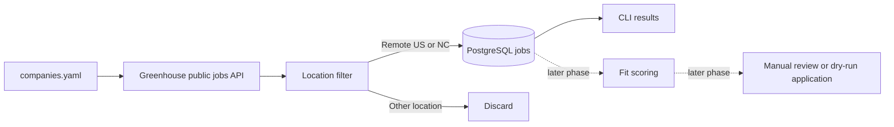

# Job Agent

A privacy-conscious job discovery and application assistant, built in reviewable phases. Phase 1 fetches public Greenhouse listings, filters for US-remote and North Carolina roles, and records new jobs in PostgreSQL. It does not score jobs or submit applications.

## Architecture



## Design Decisions

- **Two planned LLM steps:** LLM use is limited to fit scoring and grounded answers to custom application questions. Fetching, filtering, deduplication, safeguards, and persistence are deterministic code. The scorer and answer generator are added in later phases.
- **No LinkedIn scraping:** LinkedIn pages and Easy Apply are not automated. The planned LinkedIn integration reads alert emails and locates the employer's own posting.
- **Platform tiers:** Greenhouse, Lever, Ashby, and SmartRecruiters are Tier 1; Workday is Tier 2; iCIMS, Taleo, SuccessFactors, and unrecognized forms are Tier 3/manual review. Phase 1 implements Greenhouse discovery only.
- **Grounding:** Later LLM steps may use only the private profile and resume. Unknown or unsupported application questions must go to manual review rather than being guessed.
- **Privacy and submission safety:** Personal profile data, resumes, screenshots, browser state, local databases, and `.env` are ignored by Git. `profile/profile.example.yaml` contains fictional data. Phase 1 has no application-submission code; dry-run will be the default when applying is introduced.
- **Duplicate prevention:** Job URLs have a database uniqueness constraint and are checked before insert. The CLI commits each accepted listing so one later failure does not discard earlier discoveries.
- **Location scope:** Only `remote_us` and `nc` are retained. Remote roles must explicitly indicate US-wide eligibility; a bare `Remote` or a restricted state/region is not treated as US-wide. Hybrid NC inclusion is controlled by settings.
- **Unclear locations:** Labels such as `Multiple locations` and `Flexible` are persisted with `queued` status for manual review. They are not treated as eligible for automatic application.

## Setup

Requires Python 3.11+, Docker Compose, and Git. GitHub Actions runs Ruff and pytest on pushes and pull requests.

1. Create a virtual environment and install the project:

   ```powershell
   py -3.11 -m venv .venv
   .\.venv\Scripts\Activate.ps1
   python -m pip install -e ".[dev]"
   ```

2. Copy `.env.example` to `.env`. Change the local database password if the database will be reachable beyond your machine.

3. Start PostgreSQL and apply the schema migration:

   ```powershell
   docker compose up -d db
   alembic upgrade head
   ```

4. Add companies to `config/companies.yaml`. Each entry needs a display name and Greenhouse board token:

    ```yaml
    companies:
       - name: Example Company
          platform: greenhouse
          board: example-company
    ```

    Phase 1 ignores non-Greenhouse company entries with an informational log; later platform phases will handle those sources.

5. Run discovery:

   ```powershell
   job-agent
   ```

   The CLI prints newly found and previously known in-scope listings. It continues to other companies if one board request fails. `DATABASE_URL` from `.env` overrides `config/settings.yaml`.

To run the tests and linter without PostgreSQL:

```powershell
pytest
ruff check .
```

The tests use SQLite in memory and mocked HTTP responses; they do not contact job boards.

## Configuration

`config/settings.yaml` controls location behavior and HTTP retry backoff. Set `location.include_hybrid_nc` to `false` to exclude hybrid roles even when located in North Carolina. The private `profile/profile.yaml` and `profile/resume.pdf` are intentionally absent; copy the fictional example only as a schema reference and keep real personal material local.

## Results

_To be filled in as the project is exercised: companies configured, jobs discovered, location-filter results, and lessons learned._

## Roadmap

1. Project setup, Greenhouse discovery, database, and location filtering.
2. Structured fit scoring with validated output and mocked tests.
3. Greenhouse form filling in dry-run mode, grounded answers, and screenshots.
4. Other Tier 1 platforms, explicit live mode, and application safeguards.
5. Career-page routing and LinkedIn alert email parsing.
6. Grounded resume tailoring with claim traceability checks.
7. Workday fetcher and applier.
8. Daily scheduling and a FastAPI dashboard with run metrics.
