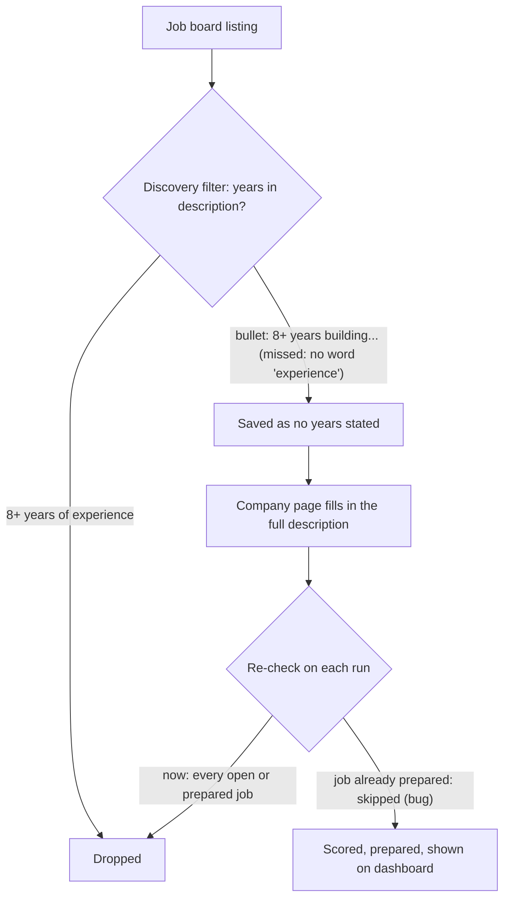

# 004: Keep only roles for recent graduates or 1 to 2 years of experience

Status: done, in review.

## Problem

The candidate graduated in December 2025. A "Data & AI" role that requires 8+ years of
experience reached the dashboard, and new-grad roles, which the candidate does qualify for,
were being dropped.

## Causes

The reported posting was not available to check, so causes 1 and 2 are the gaps found in
the code that let such a role through; together they are the likely path.

1. Confirmed in the code. `required_years` in `agent/seniority.py` only counted a number of years when
   the word "experience" was in the same sentence. Postings often list it as a bullet such as
   "8+ years building data platforms" or "Experience:" followed by "8+ years" on its own
   line, so no years were found. A role with no stated years is treated as open to the
   candidate, so it was kept. Spelled-out numbers ("eight years") and "yrs" were missed too.
2. Confirmed in the code. Jobs are checked when they are found, but a job found on a remote board or
   with a short description gets its full description later, from the company's own page.
   The later check skipped jobs already prepared ("ready for you"), so a prepared role
   that turned out to need 8+ years stayed on the dashboard.
3. Confirmed in the settings, opposite direction. The settings excluded every new-grad role and every
   posting mentioning new graduates, although the candidate is a recent graduate.

## Expected behavior

- A role that requires more than `max_years_experience` (2) years is removed, wherever the
  number appears: a bullet, a line under "Experience:", a spelled-out number, or "yrs".
  Numbers that are not requirements ("in business for 20 years", "a 4-year degree",
  preferred qualifications) are ignored.
- On every run, each open or prepared job's years are read again from its current
  description, and the dashboard's "N+ yrs" label is updated.
- New-grad roles are kept. Internships and co-ops are still removed.

## How to test

Offline tests: `tests/test_seniority.py` (the phrasings above), `tests/test_pipeline.py`
(a prepared job whose description later says 8+ years is removed, a 1 to 2 years job and a
new-grad job are kept), and `tests/test_main.py` (discovery keeps new-grad roles and drops
"3+ years building..." bullets).
