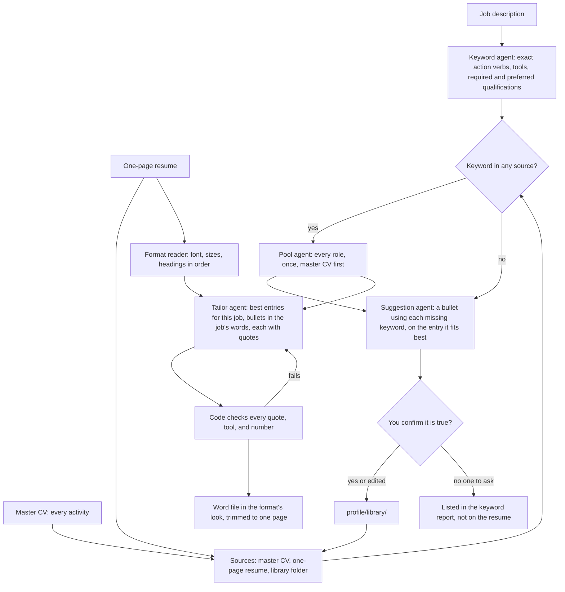

# 006: Resume builder from a master CV

## Problem

The candidate keeps two private files: a long master CV that lists every job, project, and
activity, and a finished one-page resume. Each tailored resume should pick its entries from
the master CV and reword their bullets in the job description's own words. It should also
look like the one-page resume. Before this change the tailor read only the one-page resume
and the library folder, and always used Times New Roman with fixed section headings.

## Expected behavior

- **Content.** The master CV (`MASTER_CV_PATH`, default `profile/master_cv.pdf`) is the
  first source. Every entry in it can be chosen, and choice is by fit to the job only, not
  by whether the entry was on the old one-page resume. A role that appears in both files is
  listed once. Bullets are reworded with the job's keywords, and every bullet still quotes
  the candidate's documents (unchanged checks from spec 002).
- **Format.** The format example (`RESUME_FORMAT_PATH`, default the `RESUME_PATH` resume) is
  read for its font, body text size, name size, and section headings in order, as written
  (for example "Work Experience", "Projects", "Leadership & Activities", "Technical
  Skills"). Projects go under its projects heading and leadership and activities under its
  activities heading; without one, they go under experience. Its content is not reused,
  except the name, contact line, and education lines.
- **Fallbacks.** No master CV: the resume and library are the sources, as before. No format
  example, or one with no Experience or Projects heading: the default format. Each fallback
  is noted in the kit's keyword report.
- **Missing keywords.** When a keyword from the job is in none of the sources, the
  suggestion agent writes one bullet that uses it, for the pool entry where it fits best
  (an internship, job, or project), built on a fact of that entry. Code keeps a suggestion
  only when it uses the keyword as the job spells it, names an entry in the pool, quotes a
  real fact of that entry, and adds no number. In `job-kit`, each suggestion is shown in
  the console: `y` keeps it, typed text replaces it, Enter skips it. A kept bullet is saved
  to `profile/library/keyword_answers.md` (with the entry's name) and then counts as
  evidence, so the tailor can put it on the resume. When nobody is at the console (the
  morning run), suggestions stay off the resume and are listed in the kit's keyword report,
  shown in the Apply panel, for the candidate to check.
- One page, never below 10 pt, as before: body sizes start at the format's own and go down
  half a point at a time.
- Both files stay private: `profile/*.pdf`, `profile/*.docx`, and `profile/master_cv*` are
  git-ignored and blocked by the privacy hook.

## Workflow

## How to test

Offline tests in `tests/test_resume_builder.py` with fictional PDFs written by the test:

- the format's font (Helvetica becomes Arial), body and name sizes, and headings in order,
  ignoring a "Technical Skills: Python, SQL" line;
- sizes set through the text matrix (LaTeX style), an unknown font falling back to Times
  New Roman, and missing Education or Skills headings added;
- a missing master CV or an unreadable format example falls back with a note;
- the master CV is sent first to the pool agent, the tailor is told the format's headings,
  entries land under them, and a role in both files appears once;
- the Word file uses the format's font, sizes, and heading order;
- suggestions are kept only on a real entry, with the keyword, a real basis, and no new
  number; a confirmed one is saved and used on the resume, an unconfirmed one is listed in
  the report and kept off the resume; the console's y, edit, and skip.

`tests/test_check_private_data.py` covers the new private paths.
